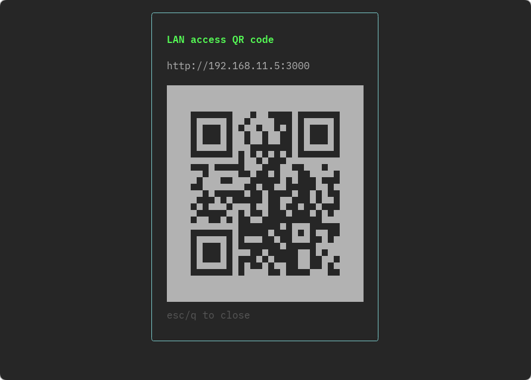

# localhost-top

[日本語版はこちら](./README.ja.md)

A TUI tool for managing LISTEN processes on localhost, operated with vim keybindings. It displays `lsof` results as a live-updating list, letting you kill processes, inspect details, or open them in a browser right from the terminal.




## Features

- Lists TCP processes LISTENing on `127.0.0.1` / `localhost` (loopback-only bind) or `0.0.0.0` (all-interfaces bind); the bind range is shown in the `SCOPE` column
- For processes bound to all interfaces (`0.0.0.0`), get a link reachable from other devices on the same LAN and copy it to the clipboard
- Auto-reloads every 2 seconds
- vim-like key operations
- Confirmation prompt before kill to prevent accidental termination

## Installation

```bash
brew tap Hol1kgmg/localhost-top
brew install --cask localhost-top
```

### Build from source

```bash
git clone https://github.com/Hol1kgmg/homebrew-localhost-top.git
cd homebrew-localhost-top
go build -o localhost-top .
```

## Usage

```bash
localhost-top
```

### Keybindings

| Key | Action |
|---|---|
| `j` / `k` | Move down / up |
| `gg` / `G` | Jump to top / bottom |
| `/` | Search mode (filter by command name or port number) |
| `K` | Kill the selected process (SIGTERM, with confirmation prompt) |
| `X` | Force kill (SIGKILL, with confirmation prompt) |
| `Enter` / `l` | Show details of the selected process (full `lsof` output) |
| `o` | Open the selected port in a browser (`http://localhost:PORT`) |
| `L` | Get a LAN access link and copy it to the clipboard (only for `0.0.0.0`-bound processes; shows a warning for `127.0.0.1`-only binds) |
| `Q` | Show a QR code for the LAN access link (only for `0.0.0.0`-bound processes; shows a warning for `127.0.0.1`-only binds) |
| `s` | Toggle sort order (PORT → PID → USER) |
| `r` | Reload the list |
| `:` | Command mode (`:q` to quit) |
| `q` | Quit |
| `?` | Show help |

### Commands (after typing `:`)

| Command | Action |
|---|---|
| `:q` | Quit |
| `:killall` | Kill all visible processes (SIGTERM, with confirmation prompt) |
| `:killall!` | Force kill all visible processes (SIGKILL, with confirmation prompt) |
| `:update` | Manually check for a new version |

When a search filter is active, `:killall` / `:killall!` only target the processes currently shown after filtering.

## Updates

On startup, the app automatically checks GitHub Releases for the latest version and notifies you in the title bar if a newer one is available (this check is skipped for source builds). You can also check manually with the `:update` command.

The app itself never rewrites its own binary — it only notifies you. To actually update, run:

```bash
brew upgrade --cask localhost-top
```

## Requirements

- macOS (depends on the `lsof` / `open` / `pbcopy` commands)
- Go 1.21+ (only if building from source)

## Development setup

Requires [mise](https://mise.jdx.dev/) installed and integrated into your shell.

macOS (Homebrew):

```bash
brew install mise
```

Shell integration (zsh):

```bash
echo 'eval "$(mise activate zsh)"' >> ~/.zshrc
source ~/.zshrc
```

```bash
mise trust && mise run setup
```

This installs gitleaks / lefthook and sets up Git hooks, and installs Go / goreleaser, all in one step.

### Running locally

```bash
go run .
```

### Releasing

Pushing a tag in `v*.*.*` format triggers GitHub Actions (`.github/workflows/release.yml`) to automatically run goreleaser.

```bash
git tag vX.X.X
git push origin vX.X.X
```

The Homebrew Cask is automatically generated and committed to the `Casks/` directory in this same repository.

### Checking version history

```bash
mise run versions
```

Lists previously released tags, newest first.

## Documentation

- [Configuration file](./docs/CONFIG.md)

## License

[MIT](./LICENSE)
