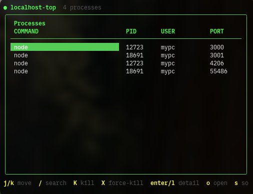

# localhost-top

vimキーバインドで操作する、localhost上のLISTENプロセス管理TUIツールです。`lsof`の結果をリアルタイムに一覧表示し、その場でプロセスをkillしたり、詳細を確認したり、ブラウザで開いたりできます。



## 特徴

- `127.0.0.1` / `localhost` でLISTENしているTCPプロセスのみを対象に表示（`0.0.0.0`など全インターフェース待受は対象外）
- 2秒間隔で自動リロード
- vimライクなキー操作
- kill実行時は誤操作防止のための確認プロンプト付き

## インストール

```bash
brew install --cask Hol1kgmg/localhost-top/localhost-top
```

### ソースからビルド

```bash
git clone https://github.com/Hol1kgmg/homebrew-localhost-top.git
cd homebrew-localhost-top
go build -o localhost-top .
```

## 使い方

```bash
localhost-top
```

### キーバインド

| キー | 動作 |
|---|---|
| `j` / `k` | 下移動 / 上移動 |
| `gg` / `G` | 先頭 / 末尾へジャンプ |
| `/` | 検索モード（コマンド名・ポート番号でフィルタ） |
| `n` / `N` | 検索結果の次 / 前 |
| `K` | 選択中プロセスをkill（SIGTERM、確認プロンプトあり） |
| `X` | 強制kill（SIGKILL、確認プロンプトあり） |
| `Enter` / `l` | 選択中プロセスの詳細表示（`lsof`フル出力） |
| `o` | 選択中ポートをブラウザで開く（`http://localhost:PORT`） |
| `s` | ソート切り替え（PORT → PID → USER） |
| `r` | リスト再読み込み |
| `:` | コマンドモード（`:q`で終了） |
| `q` | 終了 |
| `?` | ヘルプ表示 |

## 前提条件

- macOS（`lsof` / `open` コマンドに依存）
- Go 1.21以上（ソースからビルドする場合）

## 開発環境のセットアップ

[mise](https://mise.jdx.dev/) がインストールされ、シェルに統合されていること。

macOS (Homebrew):

```bash
brew install mise
```

シェル統合 (zsh):

```bash
echo 'eval "$(mise activate zsh)"' >> ~/.zshrc
source ~/.zshrc
```

```bash
mise trust && mise run setup
```

gitleaks / lefthook のインストールと Git フックの設定、Go / goreleaser のインストールが一括で行われます。

### 動作確認

```bash
go run .
```

### リリース

```bash
git tag vX.X.X
git push origin vX.X.X
goreleaser release --clean
```

同一リポジトリの`Casks/`ディレクトリにHomebrew Caskが自動生成・コミットされます。

## ライセンス

[MIT](./LICENSE)
